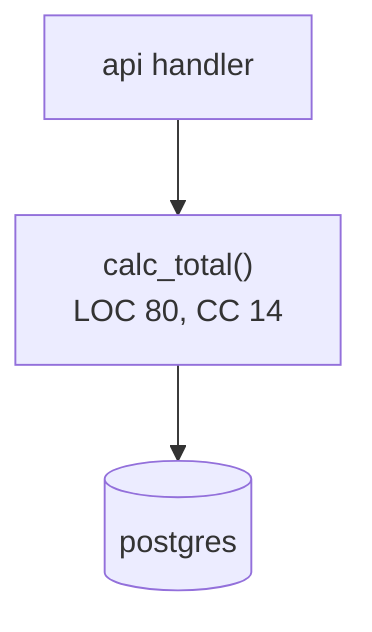
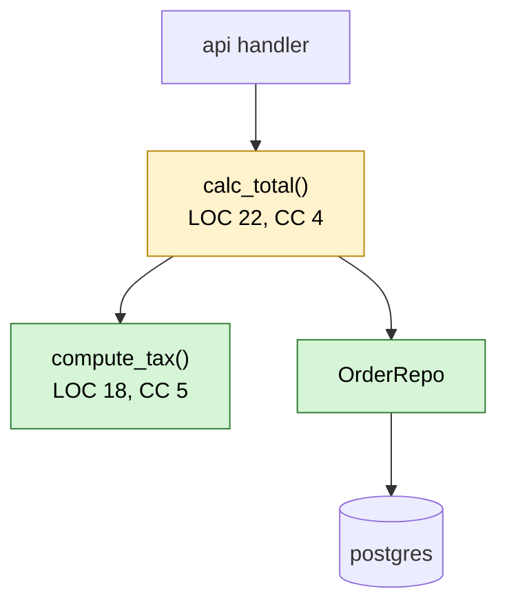
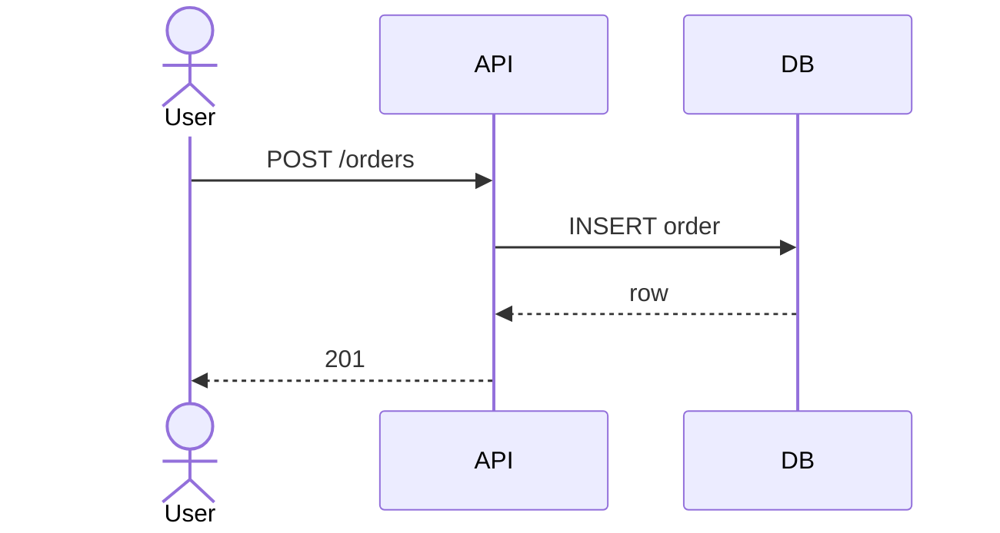
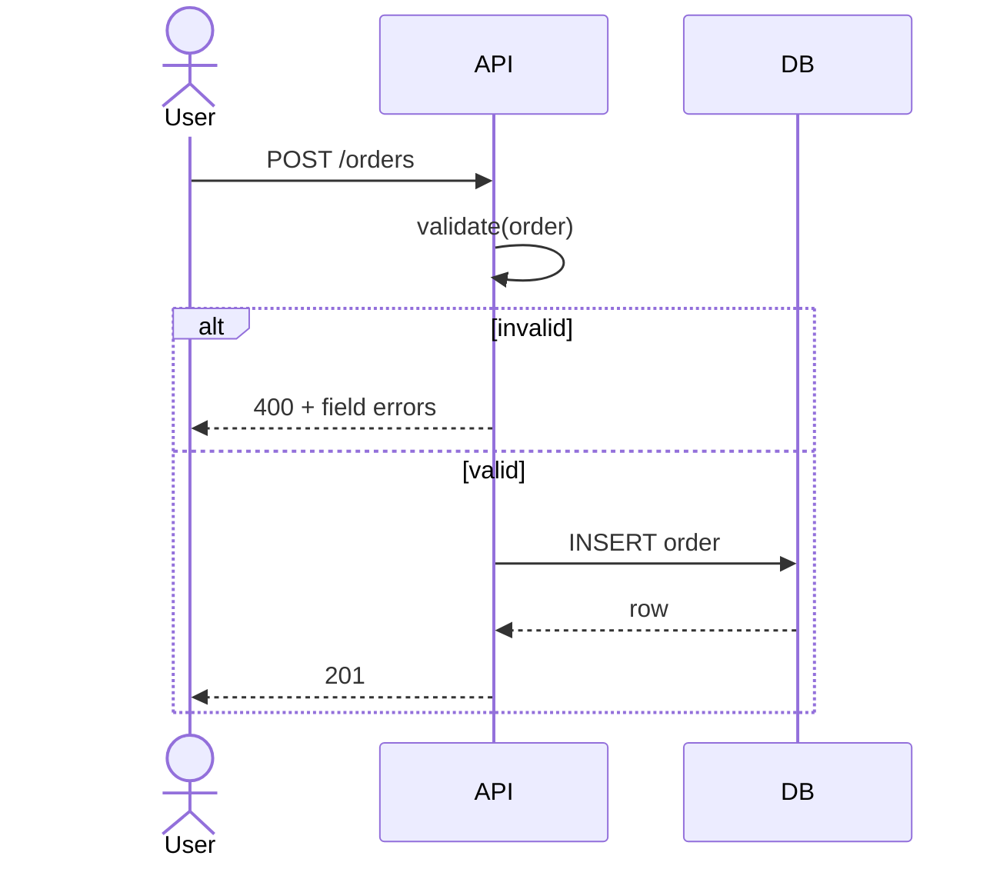

# Comparison guide

How to measure the before/after delta per dimension, and mermaid templates for the diagrams.

## What metric to compare, per dimension

"Reduced complexity" is the headline, but it only literally applies to simplicity and testability. Robustness and observability improvements *add* code on purpose — judge them by the metric the change was meant to move.

| Dimension | Headline metric | Expected direction | Also worth showing |
|-----------|-----------------|--------------------|--------------------|
| **Simplicity** | LOC + cyclomatic complexity of the touched functions | ↓ down | nesting depth, # of params, # of abstraction layers removed |
| **Testability** | cyclomatic of the extracted *pure* function + # of I/O deps in the logic path | ↓ deps, logic now isolated | # of functions now unit-testable without a DB/network/clock |
| **Robustness** | # of unhandled inputs / failure modes now covered | ↑ coverage (LOC may rise) | inputs validated at boundary, fallback paths added, bounded caches/queues |
| **Observability** | # of instrumented boundaries (spans, structured logs, metrics) | ↑ coverage (LOC may rise) | trace coverage across services, RED metrics added, runtime log-level toggle present |

When complexity rises for a robustness/observability win, state both numbers: the complexity cost and the coverage gained. A reader should see the trade was deliberate.

## Measuring consistently

- Use the **same tool/rules** as the before baseline: `gocyclo` (Go), `radon cc` (Python), `lizard` (multi-language), `eslint complexity` (JS/TS). State the tool.
- If the baseline was hand-counted, hand-count the after the same way (decision points + 1: `if`, `else if`, `case`, `&&`, `||`, `for`, `while`, `catch`, ternary) and say "counted by hand".
- LOC = function body lines, excluding signature, blanks, and comments — same as the writer's complexity map.
- Reconstruct missing before numbers from git: measure the file at the commit/tag prior to the work (`git show <ref>:path`).

## Mermaid templates

### Source / runtime structure — before & after

Render two blocks. Reuse the same node ids so the diff is visually obvious. Highlight changes with the shared classDefs.

````
**Before — Improvement #N**


**After — Improvement #N** — tax math extracted; handler no longer talks to the DB directly

````

- `:::new` — added module/function/edge.
- `:::changed` — existing element whose shape or metrics changed.
- `:::removed` — element deleted in the after state (keep it in the *before* diagram only, or show dashed in after to make the deletion explicit).
- Put the LOC/CC numbers inside the node label so the diagram and the table agree.

### Flow change — before & after (sequence)

Use when the improvement added a step to a flow (validation, fallback, retry, span, log). Keep participants identical across both; the *added* messages are the story.

````
**Before — Improvement #M**


**After — Improvement #M** — input validated at the boundary; failure returns a clean 400

````

Keep end users / external systems as `actor` on the left, consistent with the writer and reviewer skills.

## Panel self-check

Before handing each panel to the user:

- [ ] Status is one of Done / Partial / Not done / Drifted, with a file:line citation for Done/Partial.
- [ ] Diagram present only when structure changed; otherwise "no structural change — see table".
- [ ] Before and after diagrams reuse node ids and show metrics in the labels.
- [ ] Table deltas were measured with the same method as the baseline (tool named, or "by hand").
- [ ] When complexity rose, the offsetting coverage metric is shown and the trade called out.
- [ ] Verdict references the improvement's original goal and is honest about partial wins.
